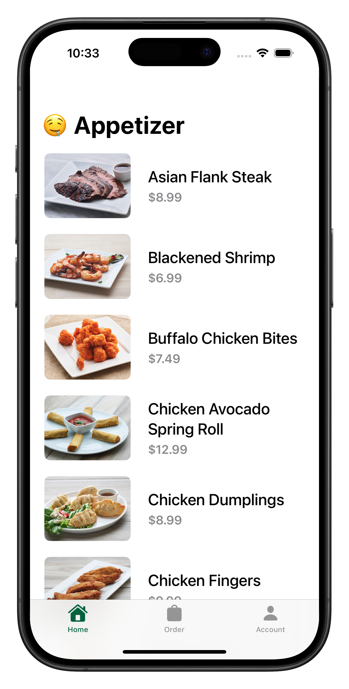
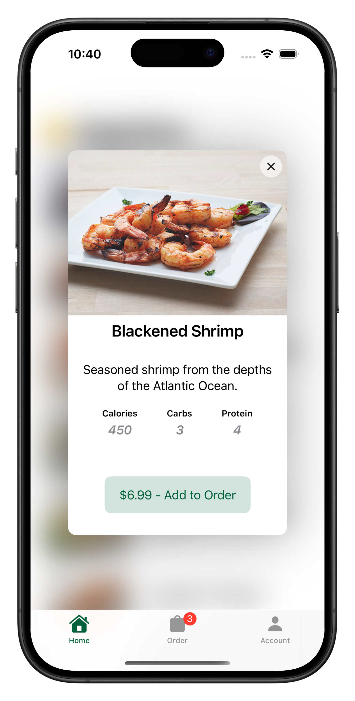
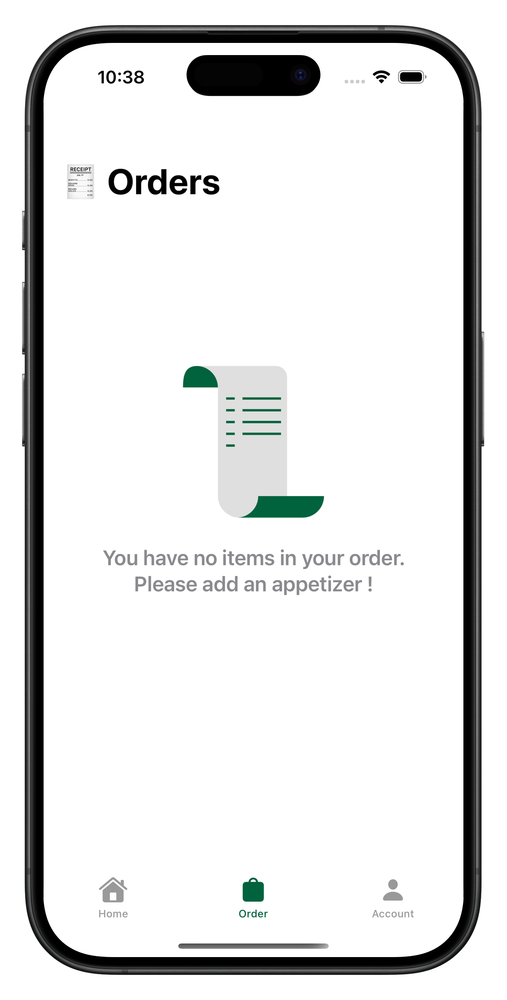
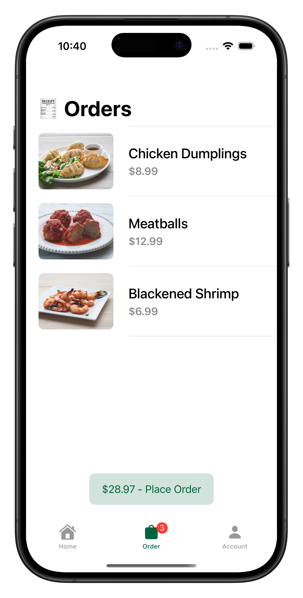
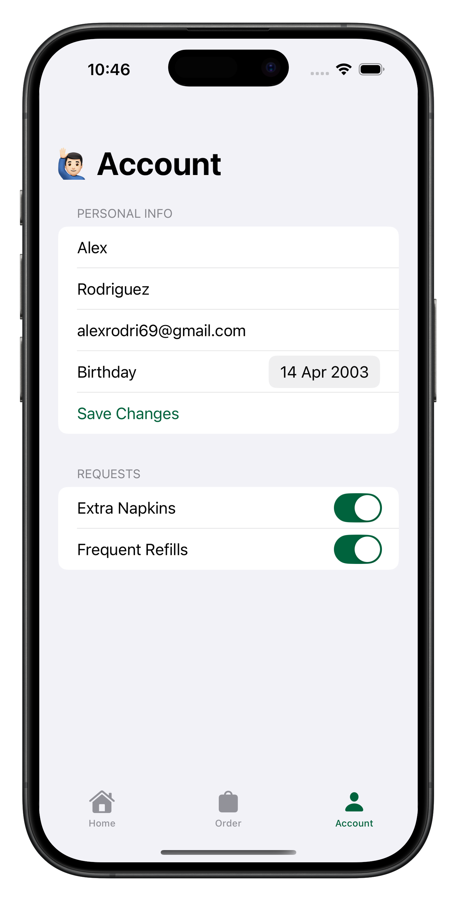

# Kolpaat 🍴  
A sleek **iOS prototype app** for ordering appetizers, **built with Swift and SwiftUI**.

## Screenshots
<table>
  <tr>
    <td></td>
    <td></td>
    <td></td>
    <td></td>
    <td></td>
  </tr>
</table>

## Features
- Browse a menu of delicious appetizers.  
- Simple and intuitive UI designed for smooth navigation.  
- Responsive layout tailored for modern iPhones.

## About
Kolpaat was developed as a **prototype** to showcase Swift and SwiftUI capabilities. It's not intended for production use but highlights design and development techniques for building intuitive iOS apps.

## Requirements
- iOS 16.0+  
- Xcode 15+  

## Installation
1. Clone this repository:
   ```bash
   git clone https://github.com/kvrarc/Kolpaat.git
